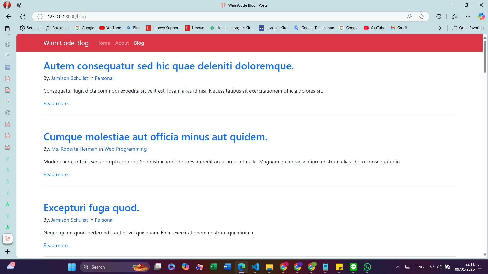

# Magang-Web-Blog-Laravel

Merupakan Project Magang Web Developer WinniCode untuk membuat Website Blog. Project ini sebagian besar dibuat dengan Laravel.

This Project is Powered by : WinniCode Garuda Teknologi


## Images

Inilah Tampilan Sederhana dari Aplikasi Web Blog menggunakan Laravel :
\
\


## Proses Instalasi

Berikut ini adalah Proses Instalasi hingga Pembuatan Project ini :

Steps :

1. Lingkungan/Environment yang digunakan

Adapun Environment yang kami gunakan dalam Project ini adalah :

- XAMPP
- PHP & MySQL
- Composer

1. Persiapan Project

Pertama, buatlah direktori baru untuk proyek Anda dan masuk ke dalamnya :

> mkdir magang-web-laravel \
> cd web-blog-laravel

Kedua, Inisialisasikan Project Laravel dengan menjalankan perintah Composer :

> composer create-project laravel/laravel web-blog-laravel

2. Menjalankan Project Laravel

Ketiklah :

> php artisan serve

## Folder Structure

Adapun Struktur Folder Direktori dari Project ini adalah :

```
📁IoT2-WWebapp-QR-Code-Scanner/
    ├── 📁images/                                      # Folder untuk Gambar-gambar
    ├── 📁web-blog-laravel/                            # Backend Laravel untuk API dan Dashboard
    │   ├── 📁app/
    │   │   ├── 📁Http/
    │   │   │   ├── 📁Controllers/
    │   │   │   │   └── PostController.php              # Controller untuk Postingan Blog
    │   │   ├── 📁Models/
    │   │   │   ├── Category.php                        # Model untuk tabel Kategori
    │   │   │   ├── Post.php                            # Model untuk tabel Postingan
    │   │   │   └── User.php                            # Model untuk tabel User
    │   │   ├── 📁Providers/
    │   │   └── 📁Services/
    │   ├── 📁config/
    │   ├── 📁database/
    │   │   ├── 📁factories/
    │   │   ├── 📁migrations/
    │   │   │   ├── 0001_01_01_000000_create_users_table.php         # Migration tabel User
    │   │   │   ├── 2024_12_23_164809_create_posts_table.php         # Migration tabel Postingan
    │   │   │   └── 2024_12_25_164004_create_categories_table.php    # Migration tabel Kategori
    │   │   └── 📁seeders/
    │   │       └── InventorySeeder.php                # Seeder untuk data dummy inventory
    │   ├── 📁public/
    │   │   ├── 📁css/
    │   │   │   └── style.css                          # File CSS
    │   │   └── 📁js/
    │   │       └── script.js                          # File JavaScript (Bila dibutuhkan)
    │   ├── 📁resources/
    │   │   └── 📁views/
    │   │       ├── 📁layouts/
    │   │       │   └── main.blade.php                 # Layout utama untuk Laravel Blade
    │   │       ├── partials/
    │   │       │   └── navbar.blade.php               # Layout Navbar untuk Laravel Blade
    │   │       ├── about.blade.php                    # Halaman Tentang Kami
    │   │       ├── categories.blade.php               # Halaman untuk menampilkan Daftar Kategori
    │   │       ├── cateogry.blade.php                 # Halaman untuk menampilkan Postingan pada Kategori
    │   │       ├── home.blade.php                     # Halaman Utama (Homepage)
    │   │       ├── post.blade.php                     # Halaman pada salah satu Potingan
    │   │       └── posts.blade.php                    # Halaman Potingan Artikel Blog
    │   ├── 📁routes/
    │   │   └── web.php                                # Route untuk halaman web
    │   ├── 📁storage/
    │   │── 📁tests/
    │   └── .env
    ├── 📁website-blog-ui/                             # Program Python OpenCV
    │   ├── 📁css/
    │   │   └── style.css                              # File CSS
    │   │── 📁js/
    │   │   └── script.js                              # File JavaScript (Bila dibutuhkan)
    │   │── 📁pages/
    │   └── index.html                                 # File HTML
    └── README.md                                      # Panduan proyek keseluruhan
```

## About Laravel

<p align="center"><a href="https://laravel.com" target="_blank"></a></p>

<p align="center">
<a href="https://github.com/laravel/framework/actions"></a>
<a href="https://packagist.org/packages/laravel/framework"></a>
<a href="https://packagist.org/packages/laravel/framework"></a>
<a href="https://packagist.org/packages/laravel/framework"></a>
</p>

Laravel is a web application framework with expressive, elegant syntax. We believe development must be an enjoyable and creative experience to be truly fulfilling. Laravel takes the pain out of development by easing common tasks used in many web projects, such as:

- [Simple, fast routing engine](https://laravel.com/docs/routing).
- [Powerful dependency injection container](https://laravel.com/docs/container).
- Multiple back-ends for [session](https://laravel.com/docs/session) and [cache](https://laravel.com/docs/cache) storage.
- Expressive, intuitive [database ORM](https://laravel.com/docs/eloquent).
- Database agnostic [schema migrations](https://laravel.com/docs/migrations).
- [Robust background job processing](https://laravel.com/docs/queues).
- [Real-time event broadcasting](https://laravel.com/docs/broadcasting).

Laravel is accessible, powerful, and provides tools required for large, robust applications.

## Learning Laravel

Laravel has the most extensive and thorough [documentation](https://laravel.com/docs) and video tutorial library of all modern web application frameworks, making it a breeze to get started with the framework.

You may also try the [Laravel Bootcamp](https://bootcamp.laravel.com), where you will be guided through building a modern Laravel application from scratch.

If you don't feel like reading, [Laracasts](https://laracasts.com) can help. Laracasts contains thousands of video tutorials on a range of topics including Laravel, modern PHP, unit testing, and JavaScript. Boost your skills by digging into our comprehensive video library.

## Laravel Sponsors

We would like to extend our thanks to the following sponsors for funding Laravel development. If you are interested in becoming a sponsor, please visit the [Laravel Partners program](https://partners.laravel.com).

### Premium Partners

- **[Vehikl](https://vehikl.com/)**
- **[Tighten Co.](https://tighten.co)**
- **[WebReinvent](https://webreinvent.com/)**
- **[Kirschbaum Development Group](https://kirschbaumdevelopment.com)**
- **[64 Robots](https://64robots.com)**
- **[Curotec](https://www.curotec.com/services/technologies/laravel/)**
- **[Cyber-Duck](https://cyber-duck.co.uk)**
- **[DevSquad](https://devsquad.com/hire-laravel-developers)**
- **[Jump24](https://jump24.co.uk)**
- **[Redberry](https://redberry.international/laravel/)**
- **[Active Logic](https://activelogic.com)**
- **[byte5](https://byte5.de)**
- **[OP.GG](https://op.gg)**

## Contributing

Thank you for considering contributing to the Laravel framework! The contribution guide can be found in the [Laravel documentation](https://laravel.com/docs/contributions).

## Code of Conduct

In order to ensure that the Laravel community is welcoming to all, please review and abide by the [Code of Conduct](https://laravel.com/docs/contributions#code-of-conduct).

## Security Vulnerabilities

If you discover a security vulnerability within Laravel, please send an e-mail to Taylor Otwell via [taylor@laravel.com](mailto:taylor@laravel.com). All security vulnerabilities will be promptly addressed.

## License

The Laravel framework is open-sourced software licensed under the [MIT license](https://opensource.org/licenses/MIT).

<!-- ## Description

**1. [Project Realtime Temperature Sensor GUI](./realtime-temperature-sensor-gui)**

Merupakan Project Aplikasi Monitoring Sensor Suhu Sederhana yang terdiri dari:
- HTML
- CSS
- JavaScript
- Bootstrap
- jQuery

**2. [Project Realtime Temperature Sensor GUI Node.js](./realtime-temperature-sensor-gui-node)**

Merupakan Lanjutan dari Project Aplikasi Monitoring Sensor Suhu Sederhana (yang di Nomor 1) yang menggunakan Framework Node.js. Untuk Project ini, melakukan Update Data secara Realtime menggunakan WebSockets, dan Server-nya menggunakan JavaScript.

Steps :
1. Persiapan Project

Pertama, buatlah direktori baru untuk proyek Anda dan masuk ke dalamnya :

> mkdir realtime-temperature-sensor
> cd realtime-temperature-sensor

Kedua, Inisialisasikan proyek Node.js dan buat file package.json dengan menjalankan perintah :

> npm init -y

2. Install Package yang Diperlukan

> npm install express http socket.io

**3. [Project Realtime Temperature Sensor GUI Laravel](./realtime-temperature-sensor-gui-laravel)**

Merupakan Lanjutan dari Project Aplikasi Monitoring Sensor Suhu Sederhana (yang di Nomor 1) yang menggunakan Framework Laravel. Untuk Project ini, melakukan Update Data secara Realtime menggunakan WebSockets, dan Server-nya menggunakan PHP.

Untuk melihat Kode Program sebelumnya, silakan [lihat di sini](https://github.com/inzaghipa1709/UTS-Webdev). -->
